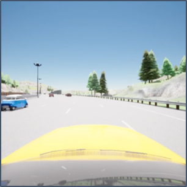
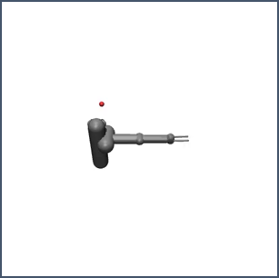
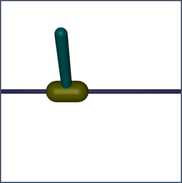
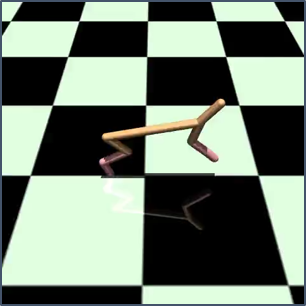
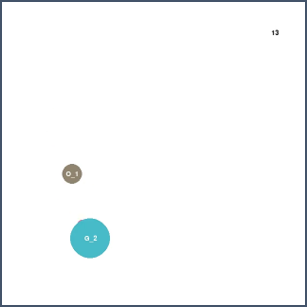
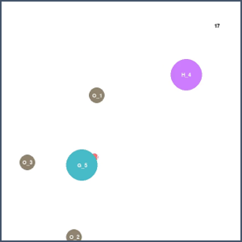
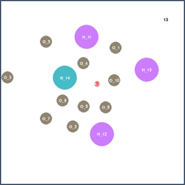
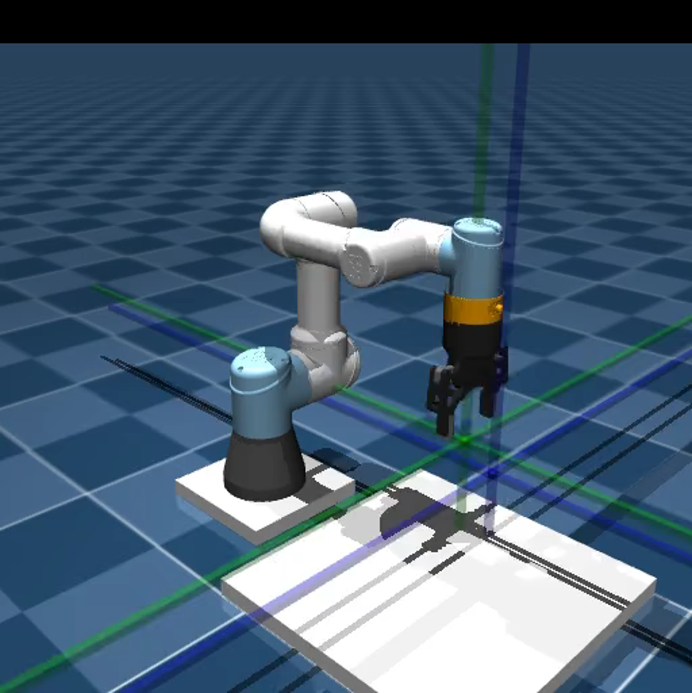
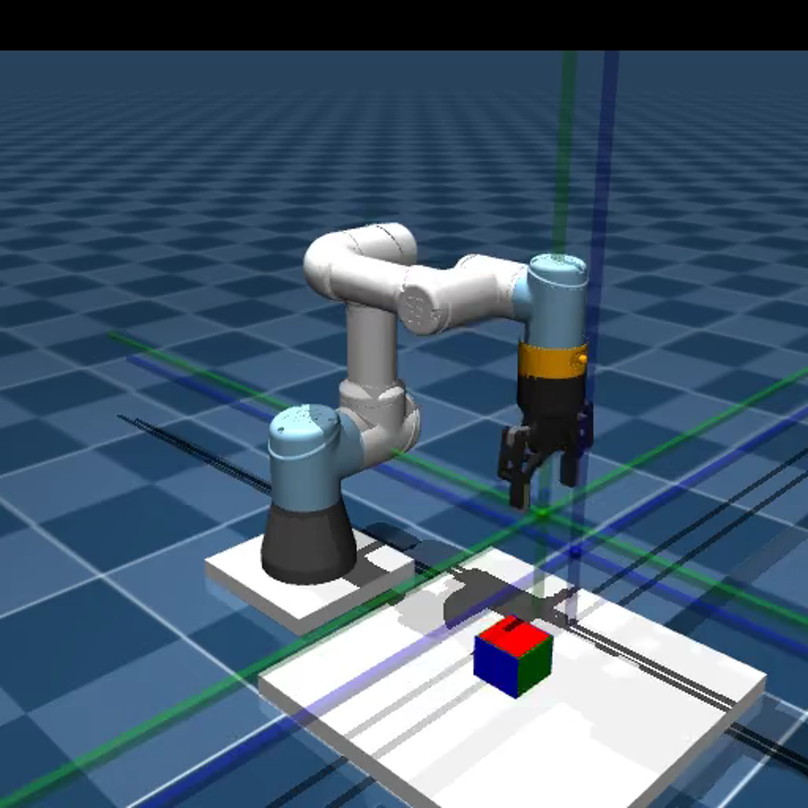
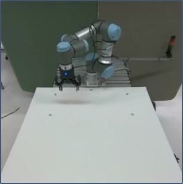

# Anomaly Gym
Anomaly-Gym is a suite of environments designed specifically for research on Anomaly Detection in Reinforcement Learning.

This repositry is the standalone package for Anomaly-Gym environments. Complementary Code for training agents, collecting & using datasets and training & evaluating detectors can be found here: https://github.com/anonymous-3-141592653/anom-rl


### List of Envs
| Env_id                     | Video                                                                           | Description                                                                                        | ObservationTypes                                                                                                                                                                                                                                                                       | Anomaly Types                                                                                                                              |
|-------------------------|---------------------------------------------------------------------------------|----------------------------------------------------------------------------------------------------|----------------------------------------------------------------------------------------------------------------------------------------------------------------------------------------------------------------------------------------------------------------------------------------|--------------------------------------------------------------------------------------------------------------------------------------------|
| Carla-LaneKeep          |          | Follow the lane at target speed and don't collide with other vehicles                              | - vector (9,) <br> -- current speed <br> -- target speed <br> -- current accell. <br> -- current heading <br> -- dist. to lane center <br> -- dist to veh. ahead <br> -- delta vel. to veh. ahead <br> -- last accel. <br> -- last steering angle <br>  - img (3x256x256)              | - brake fail <br> - steer fail <br> - slippery road <br> - Action Factor/Offset/Noise  <br> - Observation Factor/Offset/Noise         |
| Mujoco-Reacher3D        |        | Move Robot EE to goal                                                                              | - vector (4,) <br> -- joint pos. <br> -- joint vel. <br> -- img (3x128x128)                                                                                                                                                                                                            | - Mass Factor <br> - Force Vector <br> - joint friction <br> - Action Factor/Offset/Noise  <br> - Observation Factor/Offset/Noise      |
| Mujoco-CartpoleSwingup  |  | Swingup the Pole by moving the cart                                                                | - vector (17,) <br> -- joint pos. <br> -- joint vel. <br> -- img (3x128x128)                                                                                                                                                                                                           | - Mass Factor <br> - Force Vector <br> - joint friction <br> - Action Factor/Offset/Noise  <br> - Observation Factor/Offset/Noise      |
| Mujoco-HalfCheetah      |      | Control the HalfCheetah to move as fast as possible                                                | - vector (18,) <br> -- linear vel. <br> -- joint pos. <br> -- joint vel. <br> -- img (3x128x128)                                                                                                                                                                                       | - Mass Factor <br> - Force Vector <br> - joint friction <br> - Action Factor/Offset/Noise  <br> - Observation Factor/Offset/Noise      |
| Sape-Goal0              |              | Move to goal while avoiding collisions with obstacle between agent and goal                        | - vector (26,) <br> -- agent pos <br>-- agent vel <br>-- goal pos <br>-- object lidar <br>-- hazard lidar <br> - img                                                                                                                                                                   | - Force Agent <br> - Moving Objects <br> - Moving Friction <br> - Action Factor/Offset/Noise  <br> - Observation Factor/Offset/Noise   |
| Sape-Goal1              |              | Move to goal while avoiding collisions with multiple obstacles & hazards spwaned around the goal   | - vector (26,) <br> -- agent pos <br>-- agent vel <br>-- goal pos <br>-- object lidar <br>-- hazard lidar <br> - img                                                                                                                                                                   | - Force Agent <br> - Moving Objects <br> - Moving Friction <br> - Action Factor/Offset/Noise  <br> - Observation Factor/Offset/Noise   |
| Sape-Goal2              |              | Move to goal while avoiding collisions with multiple obstacles & hazards spwaned around the goal   | - vector (26,) <br> -- agent pos <br>-- agent vel <br>-- goal pos <br>-- object lidar <br>-- hazard lidar <br> - img                                                                                                                                                                   | - Force Agent <br> - Moving Objects <br> - Moving Friction <br> - Action Factor/Offset/Noise  <br> - Observation Factor/Offset/Noise   |
| URMujoco-Reach          |          | Move end-effector to target                                                                        | - vector (13,) <br> -- ee pos <br> -- ee orientation (rpy) <br> --goal pos <> --goal orientation (quat)  <br> -- img (3x128x128)                                                                                                                                                       | - Robot Speed <br> - Moving Goal <br> - Robot Friction <br> - Action Factor/Offset/Noise  <br> - Observation Factor/Offset/Noise  |
| URMujoco-PnP            |          | Move end-effector to target                                                                          | - vector (13,) <br> -- ee pos <br> -- ee orientation (rpy) <br> --goal pos <> --goal orientation (quat)  <br> --gipper state <br> --block position <br> --block orientation  <br> -- img (3x128x128)                                                                             | - Robot Speed <br> - Moving Goal <br> - Robot Friction <br> - Action Factor/Offset/Noise  <br> - Observation Factor/Offset/Noise  |
| URRtde-Reach            |             | Move end-effector to target                                                                          | - vector (13,) <br> -- ee pos <br> -- ee orientation (rpy) <br> --goal pos <> --goal orientation (quat)  <br> -- img (3x256x256)                                                                                                                                                                              | - Control Latency <br> - Moving Goal <br> - Control Smoothing <br> - Action Factor/Offset  <br> - Observation Factor/Offset      |


### Anomaly Envs

simply use the env from the table with `Anom_` as prefix, e.g. `Anom_Sape-Goal1`


### Getting started


#### Installation

we recommend using uv(https://docs.astral.sh/uv/). If you don't have it, install it with: 

    $ curl -LsSf https://astral.sh/uv/install.sh | sh

then run :

    uv sync --all-extras


### Using Environments

Using anomaly gym environments is as simple as:

````python
import gymnasium
import anomaly_gym
gymnasium.make("Anom_Sape-Goal1", anomaly_type="obs_noise", anomaly_strength="strong") 
````

### Using Carla Envs

For using carla envs, additional setup steps might be required. Checkout the  [install_notes.md](anomaly_gym/envs/carla_envs/install_notes.md)

### Using URRtde Envs

Using the URRtde Envs requires to physical UR3 robotic manipulator. You can use [ursim](https://hub.docker.com/r/universalrobots/ursim_cb3) however to test the environments. 


### Datasets

available at: https://www.kaggle.com/api/v1/datasets/download/anonymous31459/anomaly-gym


|                        | reward avg.    | cum. reward std. | ep. len. avg. | ep. len. std. | train episodes | val episodes | test episodes | anomaly episodes |
|------------------------|----------------|------------------|---------------|---------------|----------------|--------------|---------------|------------------|
| Carla-LaneKeep         | -47.26         | 33.79            | 477.85        | 74.66         | 50             | 10           | 50            | 9x4x50  = 1800   |  
| Mujoco-CartpoleSwingup | 182.664        | 0.58             | 200.0         | 0.0           | 100            | 10           | 100           | 9x4x100 = 3600   |
| Mujoco-Reacher3D       | -55.87         | 8.09             | 200.0         | 0.0           | 100            | 10           | 100           | 9x4x100 = 3600   |
| Mujoco-HalfCheetah     | 2618.61        | 24.57            | 200.0         | 0.0           | 100            | 10           | 100           | 9x4x100 = 3600   |
| Sape-Goal0             | -2.92          | 4.96             | 12.22         | 2.35          | 100            | 10           | 100           | 9x4x100 = 3600   |
| Sape-Goal1             | -6.33          | 8.15             | 13.66         | 3.50          | 100            | 10           | 100           | 9x4x100 = 3600   |
| Sape-Goal2             | -9.34          | 11.59            | 15.10         | 5.20          | 100            | 10           | 100           | 9x4x100 = 3600   |
| URMujoco-Reach         | -138.09        | 21.62            | 200.0         | 0.0           | 100            | 10           | 100           | 9x4x100 = 3600   |
| URMujoco-PnP           | -5.14          | 43.53            | 200.0         | 0.0           | 100            | 10           | 100           | 9x4x100 = 3600   |
| URRtde-Reach           | -150.18        | 45.13            | 200.0         | 0.0           | 50             | 10           | 50            | 9x4x50  = 1800   |


### Abouth the environments

#### Mujoco Contorl Envs
Mujoco environments originally taken from https://github.com/kchua/handful-of-trials/tree/master/dmbrl/env. Adapted to use official mujoco python bindings and mujoco 3.x

#### Single Agent Particle Environments
Implementation from scratch inspired by https://pettingzoo.farama.org/environments/mpe/. 

#### Carla Lane Keep Environment
Implemented from scratch using Carla python bindings but inspired by https://github.com/Farama-Foundation/D4RL/tree/master, using the `Town04` map from the official Carla repo.

#### URMujoco Envs
Implemented from scratch using Mujoco python bindings and a model of the Universal Robots UR3e.

#### URRtde
Implemented from scratch based on Mujoco Environments and using RTDE python bindings https://gitlab.com/sdurobotics/ur_rtde. 